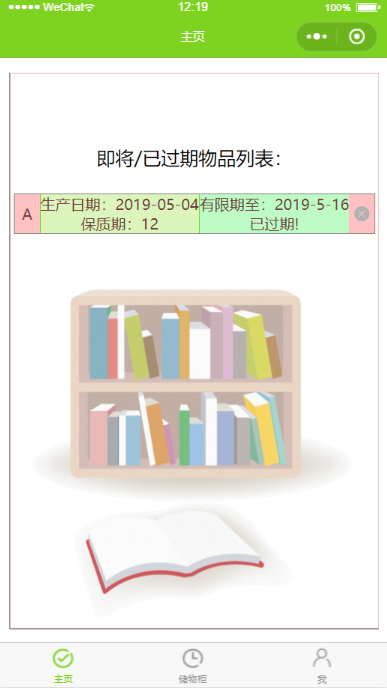
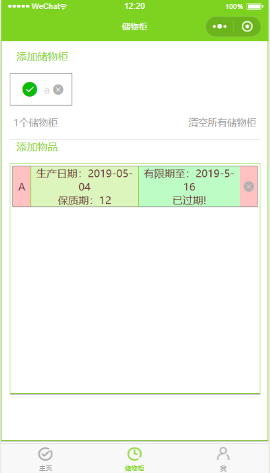

# 储物柜小程序

基于小程序本地存储管理物品保质期。

## 功能：

基于组件化开发，设置储物柜和不同物品，并通过对本地存储数据的更新和计算来显示物品是否过期。

## 预览：

## 基本介绍

分三部分：

1."主页"：显示过期物品或者部分物品列表（额好像没啥用）。

2."储物柜"：可以添加储物柜和对应储物柜中的物品，填写物品的保质期和生产日期就可以计算是否过期、到期时间、剩余天数等，信息存储基本都是对象数组的形式。

3."我"：可以查看一些问题帮助和小程序的信息，可以修改个人头像和名称（当然这都是存储在本地。。。），历史操作记录的查看，反馈等等。

## 改进

主页功能的完善；

结合本地存储和云开发实现一个可以使用的小程序；